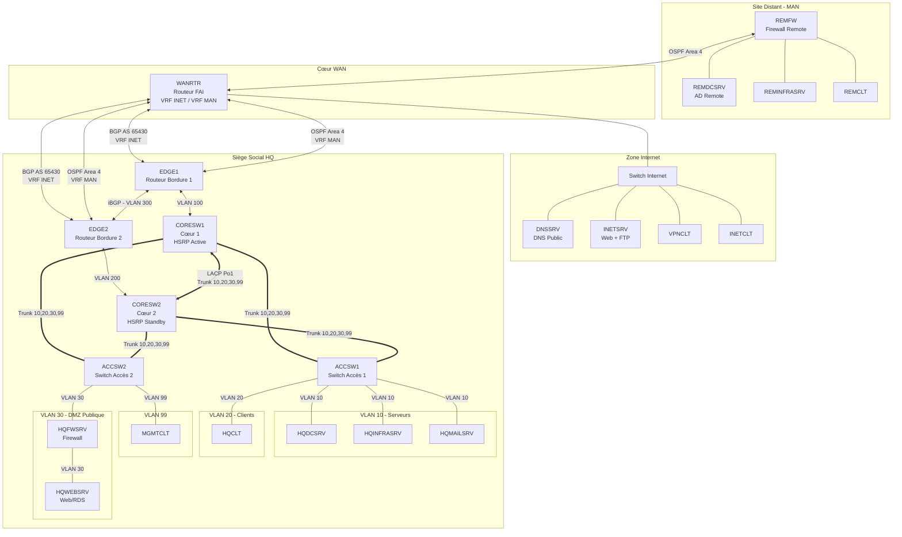

# 📘 Documentation Technique SAE 501

> **Contexte** : Infrastructure réseau WorldSkills Lyon 2025 (Adaptation SAE 501 BUT R&T)

## 🏗️ Architecture Globale



---

## 📁 Index des Procédures

### 🌐 Site HQ (Siège)

| Fichier | Machine | IP | Description |
|---------|---------|-----|-------------|
| [01-HQINFRASRV.md](01-HQINFRASRV.md) | HQINFRASRV | 10.4.10.2 | DHCP, VPN OpenVPN, Stockage LVM, iSCSI, Samba |
| [02-HQMAILSRV.md](02-HQMAILSRV.md) | HQMAILSRV | 10.4.10.3 | ZFS, Mail SMTP/IMAP, Webmail, DHCP Failover |
| [03-DCWSL.md](03-DCWSL.md) | DCWSL | 10.4.10.4 | DNS racine, Active Directory Forest Root |
| [04-HQDCSRV.md](04-HQDCSRV.md) | HQDCSRV | 10.4.10.1 | AD Child Domain, PKI/ADCS, DNS, Stockage, GPO |
| [05-HQFWSRV.md](05-HQFWSRV.md) | HQFWSRV | 217.4.160.1 / 10.4.10.5 | Firewall nftables, NAT/PAT |
| [06-HQWEBSRV.md](06-HQWEBSRV.md) | HQWEBSRV | 217.4.160.2 | Serveur Web IIS, RDS |
| [07-HQCLT.md](07-HQCLT.md) | HQCLT | DHCP | Client Windows 11 |
| [08-MGMTCLT.md](08-MGMTCLT.md) | MGMTCLT | 10.4.99.1 | Client Management, Ansible |

### 🏢 Site Remote (WSFR)

| Fichier | Machine | IP | Description |
|---------|---------|-----|-------------|
| [09-REMFW.md](09-REMFW.md) | REMFW | 10.116.4.1 / 10.4.100.126 | Firewall/Routeur ACL |
| [10-REMDCSRV.md](10-REMDCSRV.md) | REMDCSRV | 10.4.100.1 | AD Child Domain, DHCP, DNS, DFS |
| [11-REMINFRASRV.md](11-REMINFRASRV.md) | REMINFRASRV | 10.4.100.2 | AD Member, Failover services |
| [12-REMCLT.md](12-REMCLT.md) | REMCLT | DHCP | Client Windows 11 |

### 🌍 Site Internet

| Fichier | Machine | IP | Description |
|---------|---------|-----|-------------|
| [13-DNSSRV.md](13-DNSSRV.md) | DNSSRV | 8.8.4.1 | DNS Public, Root CA |
| [14-INETSRV.md](14-INETSRV.md) | INETSRV | 8.8.4.2 | Web Docker HA, FTP |
| [15-VPNCLT.md](15-VPNCLT.md) | VPNCLT | 8.8.4.3 | Client VPN |
| [16-INETCLT.md](16-INETCLT.md) | INETCLT | 8.8.4.4 | Client Internet |

---

## 🔐 Informations communes

### Mot de passe par défaut
```
P@ssw0rd
```
> Note : Le zéro est entre le "w" et le "r"

### Domaines
- **Domaine racine** : `wsl2025.org` (DCWSL)
- **Domaine HQ** : `hq.wsl2025.org` (HQDCSRV)
- **Domaine Remote** : `rem.wsl2025.org` (REMDCSRV)

---

## 📊 Ordre de déploiement recommandé

1. **Infrastructure de base** (Cœur de réseau + DNSSRV + DCWSL)
2. **Services HQ** (HQDCSRV, HQINFRASRV, HQMAILSRV)
3. **Sécurité et DMZ** (HQFWSRV, HQWEBSRV)
4. **Site Remote** (REMFW, REMDCSRV)
5. **Clients et Tests**
