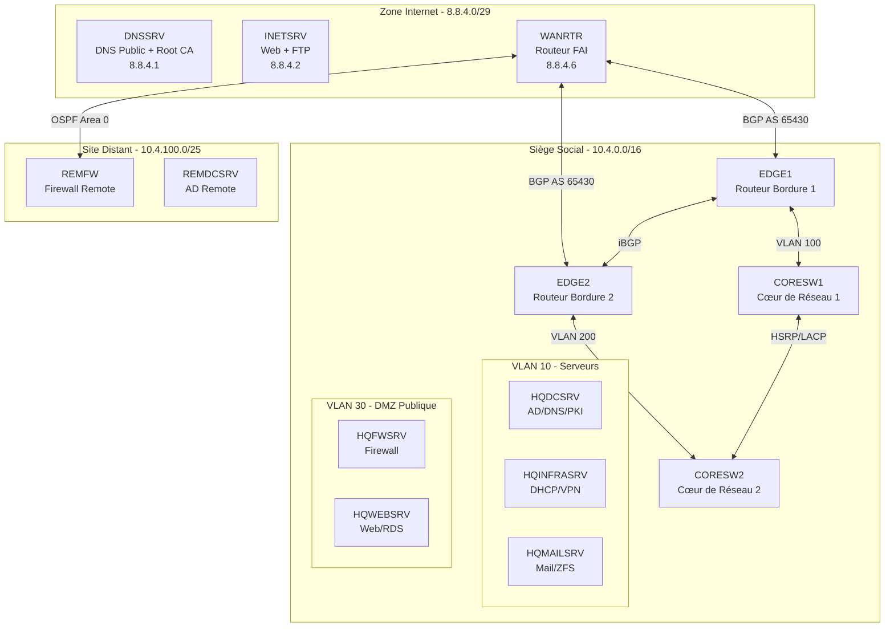

# 🌐 Infrastructure Réseau WSL2025

[](https://worldskills.org)
[](/)
[](/)
[](/)

## 📋 Présentation du Projet

Ce dépôt contient l'infrastructure complète pour la compétition **WorldSkills Lyon 2025 - Skill 39 (IT Network Systems Administration)**. L'objectif est de déployer un réseau d'entreprise sécurisé, redondant et performant, reliant un siège social (HQ), un site distant (Remote) et des services Internet.

### 🎯 Objectifs Clés
- **Haute Disponibilité (HA)** : HSRP, Etherchannel, OSPF/BGP, RAID, Failover DHCP.
- **Sécurité** : Firewalling (ACL/nftables), VPN, DMZ, Port Security, Private VLANs.
- **Services** : Active Directory, DNS, PKI, Web, Mail, RDS, FTP.
- **Automatisation** : Ansible pour la gestion des équipements réseau.

---

## 🏗️ Architecture Réseau

Le réseau est structuré en trois zones principales interconnectées :



---

## 🌍 Plan d'Adressage IP (N=4)

| Zone | VLAN | Nom | Réseau | Passerelle (VIP) |
|---|---|---|---|---|
| **HQ** | 10 | Servers | `10.4.10.0/24` | `10.4.10.254` |
| **HQ** | 20 | Clients | `10.4.20.0/23` | `10.4.20.254` |
| **HQ** | 30 | DMZ | `217.4.160.0/24` | `217.4.160.254` |
| **HQ** | 99 | Management | `10.4.99.0/24` | `10.4.99.254` |
| **Remote** | 100 | Remote LAN | `10.4.100.0/25` | `10.4.100.126` |
| **WAN** | - | MAN Link | `10.116.4.0/30` | - |
| **Internet** | - | Public | `8.8.4.0/29` | `8.8.4.6` |

---

## 🖥️ Inventaire des Serveurs

### 🏢 Site HQ (Siège)
| Serveur | OS | IP | Rôles Principaux | Documentation |
|---|---|---|---|---|
| **HQDCSRV** | Win 2022 | `10.4.10.1` | AD DS, DNS, ADCS (SubCA), GPO | [Voir le guide](documentation/04-HQDCSRV.md) |
| **HQINFRASRV** | Debian 13 | `10.4.10.2` | DHCP, VPN OpenVPN, NTP, Samba | [Voir le guide](documentation/01-HQINFRASRV.md) |
| **HQMAILSRV** | Debian 13 | `10.4.10.3` | Postfix, Dovecot, Roundcube, ZFS | [Voir le guide](documentation/02-HQMAILSRV.md) |
| **DCWSL** | Debian 13 | `10.4.10.4` | Samba AD (Forest Root), DNS | [Voir le guide](documentation/03-DCWSL.md) |
| **HQFWSRV** | Debian 13 | `217.4.160.1` | Firewall (nftables), Routing | [Voir le guide](documentation/05-HQFWSRV.md) |
| **HQWEBSRV** | Win 2022 | `217.4.160.2` | IIS, RDS (RemoteApp) | [Voir le guide](documentation/06-HQWEBSRV.md) |

### 🏭 Site Remote
| Serveur | OS | IP | Rôles Principaux | Documentation |
|---|---|---|---|---|
| **REMFW** | Cisco IOS | `10.4.100.126` | Routeur/Firewall (ACL), OSPF | [Voir le guide](documentation/09-REMFW.md) |
| **REMDCSRV** | Win 2022 | `10.4.100.1` | AD (Child), DHCP, DNS | [Voir le guide](documentation/10-REMDCSRV.md) |
| **REMINFRASRV**| Win 2022 | `10.4.100.2` | Failover DHCP, DFS | [Voir le guide](documentation/11-REMINFRASRV.md) |

### 🌐 Zone Internet
| Serveur | OS | IP | Rôles Principaux | Documentation |
|---|---|---|---|---|
| **DNSSRV** | Debian 13 | `8.8.4.1` | DNS Public, Root CA, DNSSEC | [Voir le guide](documentation/13-DNSSRV.md) |
| **INETSRV** | Debian 13 | `8.8.4.2` | Web HA (Docker), FTP (FTPS) | [Voir le guide](documentation/14-INETSRV.md) |

---

## 🚀 Guide de Déploiement Rapide

1. **Cœur de Réseau** : Déployez les configurations Cisco présentes dans le dossier [`realconf/`](realconf/).
   - Switches : `CORESW1`, `CORESW2`, `ACCSW1`, `ACCSW2`
   - Routeurs : `EDGE1`, `EDGE2`, `WANRTR`

2. **Infrastructure de Confiance (PKI/DNS)** :
   - Installez **DNSSRV** (Root CA).
   - Installez **DCWSL** (Forest Root).
   - Installez **HQDCSRV** et signez son certificat SubCA via DNSSRV.

3. **Services HQ** :
   - Déployez **HQINFRASRV** (DHCP, VPN).
   - Configurez **HQFWSRV** et **HQWEBSRV** (DMZ).
   - Mettez en place la messagerie sur **HQMAILSRV**.

4. **Site Remote** :
   - Configurez **REMFW** et connectez-le au WAN.
   - Installez **REMDCSRV** et joignez-le à la forêt.

---

## 📂 Structure du Dépôt

```bash
configreseau/
├── documentation/          # 📘 Guides d'installation pas-à-pas (Markdown)
│   ├── 00-INDEX.md         # Table des matières détaillée
│   └── [01-16]-*.md        # Procédures pour chaque machine
├── realconf/               # ⚙️ Configurations Cisco IOS réelles (Running-config)
│   ├── JALONS-PREUVES.txt  # Preuves de validation des jalons
│   ├── PLAN-ADRESSAGE.txt  # Plan IP complet
│   └── *.txt               # Configs routeurs/switches
├── virtconf/               # 🧪 Configurations pour environnement virtuel (GNS3/EVE-NG)
└── sujet*.md               # 📄 Sujets originaux de la compétition
```

## 🔐 Accès et Credentials

- **Domaine AD** : `wsl2025.org`
- **Utilisateur Admin** : `Administrator` / `admin`
- **Mot de passe par défaut** : `P@ssw0rd` *(Zéro entre w et r)*

## 👥 Auteurs

Projet réalisé dans le cadre du **BUT3 Réseaux & Télécommunications** - *Université de Franche-Comté*.

> *WorldSkills Lyon 2025 - IT Network Systems Administration*
