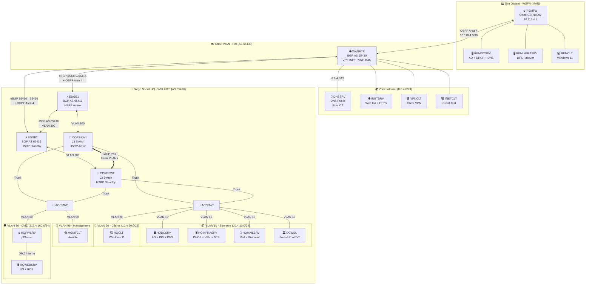

<p align="center">
  
</p>

<h1 align="center">
  🌐 Infrastructure Réseau WSL2025
  <br/>
  <sub>SAE 501 - Concevoir, Réaliser et Présenter une Solution Technologique</sub>
</h1>

<p align="center">
  
  
  
</p>

<p align="center">
  
  
  
</p>

<p align="center">
  <a href="#presentation">📌 Présentation</a> •
  <a href="#architecture">🏗️ Architecture</a> •
  <a href="#technologies">🛠️ Technologies</a> •
  <a href="#equipe">👥 Équipe</a> •
  <a href="#documentation">📂 Documentation</a>
</p>

---

<a id="presentation"></a>

## 🎯 Présentation

> _« Le professionnel R&T, en charge d'un projet technique, doit assurer l'ensemble des étapes du projet en concevant, réalisant et en présentant une solution technique mariant les différentes technologies réseaux, télécommunications et informatiques. »_
> — Programme National BUT R&T

Ce projet est réalisé dans le cadre de la **SAE 501** en 3ème année de **BUT Réseaux & Télécommunications** à l'IUT de Belfort-Montbéliard. Il s'appuie sur le sujet officiel de la compétition **WorldSkills Lyon 2025 - Skill 39 (IT Network Systems Administration)**.

### 📋 Contexte WorldSkills

|                        |                                                                 |
| ---------------------- | --------------------------------------------------------------- |
| 🏢 **Client fictif**   | WorldSkills Lyon 2025 (WSL2025) - Organisation des compétitions |
| 🤝 **Partenaire**      | WorldSkills France (WSFR) - Site distant connecté via MAN       |
| 👥 **Effectif simulé** | ~120 employés répartis sur 2 sites                              |
| 🎯 **Objectif**        | Infrastructure réseau complète, sécurisée et redondante         |

### 🏆 Compétences Développées

<table>
<tr>
<td align="center" width="25%">

**🔧 Infrastructure**
<br/>
<sub>Architecture multi-sites<br/>Redondance HSRP/LACP<br/>VRF & Segmentation</sub>

</td>
<td align="center" width="25%">

**🌐 Routage**
<br/>
<sub>OSPF Multi-Area<br/>BGP eBGP/iBGP<br/>NAT/PAT</sub>

</td>
<td align="center" width="25%">

**🖥️ Services**
<br/>
<sub>Active Directory<br/>DNS/DHCP/PKI<br/>Mail/Web/VPN</sub>

</td>
<td align="center" width="25%">

**🔐 Sécurité**
<br/>
<sub>Firewall nftables<br/>Certificats X.509<br/>VPN OpenVPN</sub>

</td>
</tr>
</table>

---

<a id="architecture"></a>

## 🏗️ Architecture

### Vue d'ensemble

```
                        ┌─────────────────────────────────────────┐
                        │         🌐 ZONE INTERNET (8.8.4.0/29)   │
                        │  DNSSRV   INETSRV   VPNCLT    INETCLT   │
                        │  8.8.4.1  8.8.4.2   8.8.4.3   8.8.4.4   │
                        │  Root CA  Web+FTP   VPN Test  Test CLT  │
                        └────────────────┬────────────────────────┘
                                         │
┌────────────────────┐      ┌────────────┴────────────┐      ┌────────────────────┐
│  🏭 SITE REMOTE    │      │        WANRTR           │      │   🏢 SITE HQ       │
│     (WSFR)         │      │   ┌───────────────┐     │      │    (WSL2025)       │
│                    │      │   │ VRF INET      │     │      │                    │
│  ┌──────────┐      │      │   │ VRF MAN       │     │      │ ┌────────────────┐ │
│  │  REMFW   │◄─────┼──────┼───│ AS 65430      │─────┼──────┼►│ EDGE1 + EDGE2  │ │
│  │ 10.116.4.1      │ OSPF │   └───────────────┘     │ BGP+ │ │ (iBGP + HSRP)  │ │
│  └────┬─────┘      │Area 4│                         │ OSPF │ └───────┬────────┘ │
│       │            │      └─────────────────────────┘      │  VLAN   │ VLAN     │
│  ┌────┴────┐       │                                       │  100    │ 200      │
│  │REMDCSRV │       │                                       │ ┌───────┴───────┐  │
│  │REMINFRA │       │                                       │ │CORESW1─CORESW2│  │
│  │ REMCLT  │       │                                       │ │(HSRP + LACP)  │  │
│  └─────────┘       │                                       │ └───────┬───────┘  │
│ 10.4.100.0/25      │                                       │         │Trunks    │
└────────────────────┘                                       │ ┌───────┴───────┐  │
                                                             │ │ACCSW1 + ACCSW2│  │
                                                             │ └───────┬───────┘  │
                                                             │         │          │
  ┌──────────────────────────────────────────────────────────┼─────────┴─────┐    │
  │                         VLANS HQ                         │               │    │
  │  ┌─────────────────┐ ┌──────────────┐ ┌───────────────┐ │┌────────────┐ │    │
  │  │ VLAN 10 Servers │ │VLAN 20 Client│ │VLAN 99 Mgmt   │ ││VLAN 30 DMZ │ │    │
  │  │ HQDCSRV  .1     │ │ HQCLT (DHCP) │ │ MGMTCLT .1    │ ││HQFWSRV .1  │ │    │
  │  │ HQINFRASRV .2   │ │              │ │ (Ansible)     │ ││HQWEBSRV .2 │ │    │
  │  │ HQMAILSRV .3    │ │              │ │               │ ││(IIS + RDS) │ │    │
  │  │ DCWSL .4        │ │              │ │               │ │└────────────┘ │    │
  │  │ (Forest Root)   │ │              │ │               │ │ 217.4.160.0/24│    │
  │  └─────────────────┘ └──────────────┘ └───────────────┘ └──────────────┘│    │
  │   10.4.10.0/24        10.4.20.0/23     10.4.99.0/24                     │    │
  └─────────────────────────────────────────────────────────────────────────┘    │
└────────────────────────────────────────────────────────────────────────────────┘
```

### Schéma Mermaid Interactif



---

<a id="technologies"></a>

## 🛠️ Technologies

### Stack Réseau

<p align="center">
  
  
  
  
  
</p>
<p align="center">
  
  
  
  
  
</p>

### Stack Systèmes

<p align="center">
  
  
  
</p>
<p align="center">
  
  
  
  
  
</p>

### Stack Services

<p align="center">
  
  
  
  
  
</p>
<p align="center">
  
  
  
  
  
  
</p>

### Stack Stockage

<p align="center">
  
  
  
  
  
  
</p>

### Stack Sécurité

<p align="center">
  
  
  
  
  
  
</p>

---

## 📊 Plan d'Adressage IP Complet (N=4)

### 🏷️ VLANs

| VLAN | Nom | Description | Réseau |
|:---:|---|---|---|
| 10 | Servers | Serveurs HQ | `10.4.10.0/24` |
| 20 | Clients | Clients HQ (DHCP) | `10.4.20.0/23` |
| 30 | DMZ | Zone DMZ publique | `217.4.160.0/24` |
| 99 | Management | Gestion équipements | `10.4.99.0/24` |
| 100 | CORESW1-EDGE1 | Lien CORESW1 ↔ EDGE1 | `10.4.254.0/30` |
| 200 | CORESW2-EDGE2 | Lien CORESW2 ↔ EDGE2 | `10.4.254.4/30` |
| 300 | IBGP_peering | iBGP EDGE1 ↔ EDGE2 | `10.4.254.8/30` |
| 666 | Blackhole | Native VLAN (sécurité) | N/A |

### 🏢 Site HQ - VLAN 10 (Servers) - `10.4.10.0/24`

| Équipement | IP | Rôle |
|---|---|---|
| HQDCSRV | `10.4.10.1` | Child DC, DNS, ADCS SubCA, GPO |
| HQINFRASRV | `10.4.10.2` | DHCP, VPN, NTP, Samba, iSCSI |
| HQMAILSRV | `10.4.10.3` | SMTP, IMAP, Webmail, DHCP Failover |
| DCWSL | `10.4.10.4` | Forest Root DC, DNS wsl2025.org |
| HQFWSRV (LAN) | `10.4.10.5` | pfSense - interface Servers |
| CORESW1 | `10.4.10.253` | HSRP Active |
| CORESW2 | `10.4.10.252` | HSRP Standby |
| **VIP HSRP** | `10.4.10.254` | **Gateway virtuelle** |

### 🏢 Site HQ - VLAN 20 (Clients) - `10.4.20.0/23`

| Équipement | IP | Rôle |
|---|---|---|
| HQCLT | DHCP | Client Windows 11 |
| CORESW1 | `10.4.20.253` | HSRP Active |
| CORESW2 | `10.4.20.252` | HSRP Standby |
| **VIP HSRP** | `10.4.20.254` | **Gateway virtuelle** |

> **DHCP** : Plage `10.4.20.1 - 10.4.21.200` • Lease 2h • DNS: `hqdcsrv.hq.wsl2025.org`

### 🏢 Site HQ - VLAN 30 (DMZ) - `217.4.160.0/24`

| Équipement | IP | Rôle |
|---|---|---|
| HQFWSRV (WAN) | `217.4.160.1` | pfSense - interface DMZ |
| HQWEBSRV | `217.4.160.2` | IIS, RDS (Word/Excel) |
| EDGE1 | `217.4.160.253` | HSRP Active |
| EDGE2 | `217.4.160.252` | HSRP Standby |
| **VIP HSRP** | `217.4.160.254` | **Gateway virtuelle publique** |

### 🏢 Site HQ - VLAN 99 (Management) - `10.4.99.0/24`

| Équipement | IP | Rôle |
|---|---|---|
| MGMTCLT | `10.4.99.1` | Ansible (Debian GUI) |
| ACCSW1 | `10.4.99.11` | Access Switch 1 |
| ACCSW2 | `10.4.99.12` | Access Switch 2 |
| CORESW1 | `10.4.99.253` | HSRP Active |
| CORESW2 | `10.4.99.252` | HSRP Standby |
| **VIP HSRP** | `10.4.99.254` | **Gateway virtuelle** |

### 🔗 Liens Internes (Core Network)

| Liaison | VLAN | Réseau | IP Équipement 1 | IP Équipement 2 |
|---|:---:|---|---|---|
| CORESW1 ↔ EDGE1 | 100 | `10.4.254.0/30` | CORESW1: `.2` | EDGE1: `.1` |
| CORESW2 ↔ EDGE2 | 200 | `10.4.254.4/30` | CORESW2: `.6` | EDGE2: `.5` |
| EDGE1 ↔ EDGE2 (iBGP) | 300 | `10.4.254.8/30` | EDGE1: `.9` | EDGE2: `.10` |
| EDGE1 ↔ WANRTR (MAN) | 13 | `10.4.254.12/30` | EDGE1: `.13` | WANRTR: `.14` |
| EDGE2 ↔ WANRTR (MAN) | 15 | `10.4.254.16/30` | EDGE2: `.18` | WANRTR: `.17` |

### 🌐 Liens Internet (VRF INET)

| Liaison | VLAN | Réseau | IP Équipement 1 | IP Équipement 2 |
|---|:---:|---|---|---|
| EDGE1 ↔ WANRTR | 14 | `91.4.222.96/29` | EDGE1: `.97` | WANRTR: `.98` |
| EDGE2 ↔ WANRTR | 16 | `31.4.126.12/30` | EDGE2: `.13` | WANRTR: `.14` |

**Provider Independent IPs (Loopback0)** : `191.4.157.32/28`
- EDGE1: `191.4.157.33` • EDGE2: `191.4.157.34`

### 🌍 Zone Internet - `8.8.4.0/29`

| Équipement | IP | Rôle |
|---|---|---|
| DNSSRV | `8.8.4.1` | DNS Public, Root CA |
| INETSRV | `8.8.4.2` | Web HA (Docker), FTPS |
| VPNCLT | `8.8.4.3` | Client VPN (test) |
| INETCLT | `8.8.4.4` | Client Internet (test) |
| WANRTR | `8.8.4.6` | Gateway Internet |

### 🏭 Site Remote - `10.4.100.0/25`

| Équipement | IP | Rôle |
|---|---|---|
| REMDCSRV | `10.4.100.1` | AD Child, DNS, DHCP |
| REMINFRASRV | `10.4.100.2` | DFS, Failover |
| REMCLT | DHCP | Client Windows 11 |
| REMFW | `10.4.100.126` | Gateway / Firewall |

> **Lien WAN** : REMFW (`10.116.4.1`) ↔ WANRTR (`10.116.4.2`) via `10.116.4.0/30`
> **DHCP** : Plage `10.4.100.10 - 10.4.100.120` • DNS: `remdcsrv.rem.wsl2025.org`

### ⚙️ Configuration HSRP

| Groupe | VLAN | VIP | Active | Standby | Priority |
|:---:|:---:|---|---|---|---|
| 10 | 10 | `10.4.10.254` | CORESW1 | CORESW2 | 110/100 |
| 20 | 20 | `10.4.20.254` | CORESW1 | CORESW2 | 110/100 |
| 99 | 99 | `10.4.99.254` | CORESW1 | CORESW2 | 110/100 |
| 30 | 30 | `217.4.160.254` | EDGE1 | EDGE2 | 110/100 |

### 🔀 Protocoles de Routage

**OSPF Area 4 (NSSA) - VRF MAN**
- Participants : EDGE1, EDGE2, WANRTR, REMFW
- Auth : MD5 (`P@ssw0rd`)
- Network Type : Point-to-Point

**BGP**
| AS | Équipements | Type |
|---|---|---|
| 65416 | EDGE1, EDGE2 | iBGP entre eux |
| 65430 | WANRTR | eBGP avec EDGE1/EDGE2 |

**Réseaux annoncés :**
- AS 65416 : `191.4.157.32/28`, `217.4.160.0/24`
- AS 65430 : `8.8.4.0/29`

### 🔄 Configuration NAT

**PAT (Overload)** : `10.4.0.0/16` → Interface WAN

**Static NAT :**
| Service | IP Publique | IP Privée | Port |
|---|---|---|---|
| VPN OpenVPN | `191.4.157.33:4443` | `10.4.10.2:443` | TCP |
| Webmail HTTP | `191.4.157.33:80` | `10.4.10.3:80` | TCP |
| Webmail HTTPS | `191.4.157.33:443` | `10.4.10.3:443` | TCP |

---

## 🖥️ Inventaire des Machines

### 🏢 Site HQ (Siège - 6 serveurs)

| Serveur        | OS                   | IP            | Rôles                                |                 Doc                  |
| -------------- | -------------------- | ------------- | ------------------------------------ | :----------------------------------: |
| **HQDCSRV**    | Windows Server 2022  | `10.4.10.1`   | AD DS, DNS, ADCS (SubCA), GPO        |  [📘](documentation/04-HQDCSRV.md)   |
| **HQINFRASRV** | Debian 13            | `10.4.10.2`   | DHCP, VPN OpenVPN, NTP, Samba, iSCSI | [📘](documentation/01-HQINFRASRV.md) |
| **HQMAILSRV**  | Debian 13            | `10.4.10.3`   | Postfix, Dovecot, Roundcube, ZFS     | [📘](documentation/02-HQMAILSRV.md)  |
| **DCWSL**      | Debian 13 (Samba AD) | `10.4.10.4`   | Forest Root DC, DNS wsl2025.org      |   [📘](documentation/03-DCWSL.md)    |
| **HQFWSRV**    | pfSense              | `217.4.160.1` | Firewall, NAT/PAT, Routing           |  [📘](documentation/05-HQFWSRV.md)   |
| **HQWEBSRV**   | Windows Server 2022  | `217.4.160.2` | IIS, RDS (RemoteApp)                 |  [📘](documentation/06-HQWEBSRV.md)  |

### 🏭 Site Remote (3 équipements)

| Équipement      | OS                   | IP             | Rôles                      |                  Doc                  |
| --------------- | -------------------- | -------------- | -------------------------- | :-----------------------------------: |
| **REMFW**       | Cisco IOS (CSR1000v) | `10.4.100.126` | Routeur/Firewall ACL, OSPF |    [📘](documentation/09-REMFW.md)    |
| **REMDCSRV**    | Windows Server 2022  | `10.4.100.1`   | AD Child, DHCP, DNS, DFS   |  [📘](documentation/10-REMDCSRV.md)   |
| **REMINFRASRV** | Windows Server 2022  | `10.4.100.2`   | Failover DHCP/DNS, DFS     | [📘](documentation/11-REMINFRASRV.md) |

### 🌐 Zone Internet (4 machines)

| Machine     | OS            | IP        | Rôles                       |                Doc                |
| ----------- | ------------- | --------- | --------------------------- | :-------------------------------: |
| **DNSSRV**  | Debian 13     | `8.8.4.1` | DNS Public, Root CA, DNSSEC | [📘](documentation/13-DNSSRV.md)  |
| **INETSRV** | Debian 13     | `8.8.4.2` | Web HA (Docker), FTPS       | [📘](documentation/14-INETSRV.md) |
| **VPNCLT**  | Windows 11    | `8.8.4.3` | Client VPN (test)           | [📘](documentation/15-VPNCLT.md)  |
| **INETCLT** | Debian 13 GUI | `8.8.4.4` | Client Internet (test)      | [📘](documentation/16-INETCLT.md) |

---

## 🚀 Guide de Déploiement

### Ordre recommandé

```
Phase 1 - Fondations          Phase 2 - Services HQ        Phase 3 - Expansion
━━━━━━━━━━━━━━━━━━━           ━━━━━━━━━━━━━━━━━━━          ━━━━━━━━━━━━━━━━━━
   ┌─────────────┐               ┌─────────────┐              ┌─────────────┐
   │ 1. Switches │               │ 4. HQINFRASRV│              │ 7. REMFW    │
   │   & VLANs   │               │   DHCP/VPN  │              │   Routing   │
   └──────┬──────┘               └──────┬──────┘              └──────┬──────┘
          ▼                             ▼                            ▼
   ┌─────────────┐               ┌─────────────┐              ┌─────────────┐
   │ 2. Routeurs │               │ 5. HQFWSRV  │              │ 8. REMDCSRV │
   │ OSPF & BGP  │               │   Firewall  │              │   AD Child  │
   └──────┬──────┘               └──────┬──────┘              └──────┬──────┘
          ▼                             ▼                            ▼
   ┌─────────────┐               ┌─────────────┐              ┌─────────────┐
   │ 3. DNSSRV   │               │ 6. HQWEBSRV │              │ 9. Clients  │
   │  + DCWSL    │               │  + MAILSRV  │              │   & Tests   │
   └─────────────┘               └─────────────┘              └─────────────┘
```

### Commandes rapides

```bash
# Vérifier les adjacences OSPF
show ip ospf neighbor

# Vérifier les sessions BGP
show ip bgp summary

# Tester la connectivité inter-sites
ping 10.4.100.1 source 10.4.10.1
```

---

<a id="documentation"></a>

## 📂 Structure du Projet

```
📁 configreseau/
├── 📄 readme.md                 # Ce fichier
├── 📄 sujet1.md                 # Sujet technique complet (EN)
├── 📄 sujet2.md                 # Présentation SAE 501 (FR)
├── 🖼️ SAE501-2025-*.jpg         # Schémas d'architecture (4 fichiers)
│
├── 📁 documentation/            # 📘 Guides d'installation détaillés
│   ├── 00-INDEX.md              # Table des matières
│   └── [01-16]-*.md             # Procédures par machine
│
├── 📁 realconf/                 # ⚙️ Configurations réelles (Cisco IOS)
│   ├── PLAN-ADRESSAGE-IP.txt    # Plan d'adressage complet
│   ├── JALONS-PREUVES.txt       # Preuves de validation
│   ├── edge1.txt / edge2.txt    # Configs routeurs bordure
│   ├── coresw1.txt / coresw2.txt # Configs switches cœur
│   ├── accsw1.txt / accsw2.txt  # Configs switches accès
│   ├── wanrtr.txt               # Config routeur WAN (VRF)
│   └── remfw.txt                # Config firewall remote
│
└── 📁 virtconf/                 # 🧪 Configurations virtuelles (GNS3/EVE-NG)
    ├── jalon7-switches/         # Configs switches (jalon 7)
    └── jalon8-routeurs/         # Configs routeurs (jalon 8)
```

---

<a id="equipe"></a>

## 👥 Équipe - Groupe 4

<table>
<tr>
<td align="center" width="25%">
<br/>
<sub><b>Parcours Cyber</b></sub><br/>
<sub>PKI • Firewall • VPN</sub>
</td>
<td align="center" width="25%">
<br/>
<sub><b>Parcours Cyber</b></sub><br/>
<sub>AD • DNS • Sécurité</sub>
</td>
<td align="center" width="25%">
<br/>
<sub><b>Parcours PilPro</b></sub><br/>
<sub>Gestion de projet</sub>
</td>
<td align="center" width="25%">
<br/>
<sub><b>Parcours PilPro</b></sub><br/>
<sub>Gestion de projet</sub>
</td>
</tr>
</table>

> 📍 **Salle de réunion** : 005 | **Infra réseau** : Salle 203

---

## 🔐 Credentials par défaut

| Service            | Utilisateur     | Mot de passe |
| ------------------ | --------------- | ------------ |
| Équipements réseau | `admin`         | `P@ssw0rd`   |
| Domaine AD         | `Administrator` | `P@ssw0rd`   |
| Linux (root)       | `root`          | `P@ssw0rd`   |

> ⚠️ **Note** : Le zéro (0) est entre le "w" et le "r"

### Domaines Active Directory

```
wsl2025.org          (Forest Root - DCWSL)
├── hq.wsl2025.org   (Child Domain - HQDCSRV)
└── rem.wsl2025.org  (Child Domain - REMDCSRV)
```

---

## 📈 Progression

```
Cœur Réseau      [██████████████████████████████] 100% ✅
Services HQ      [██████████████████████████████] 100% ✅
Site Remote      [██████████████████████████████] 100% ✅
Documentation    [██████████████████████████████] 100% ✅
Tests & Valid.   [██████████████████████████████] 100% ✅
```

---

## 📚 Ressources

- 🔗 [WorldSkills France](https://www.worldskills-france.org)
- 🔗 [Moodle SAE 501](https://moodle.univ-fcomte.fr)
- 🔗 [IUT Belfort-Montbéliard](https://www.iut-bm.univ-fcomte.fr/)

---

<p align="center">
  
  
</p>

<p align="center">
  <sub>
    <b>SAE 501</b> • BUT Réseaux & Télécommunications • 3ème année<br/>
    Université de Franche-Comté • Décembre 2025<br/><br/>
    <i>Basé sur le sujet WorldSkills Lyon 2025 - Skill 39 (IT Network Systems Administration)</i>
  </sub>
</p>

<p align="center">
  <sub>
    © WorldSkills France - Reproduction autorisée à des fins pédagogiques non commerciales
  </sub>
</p>
