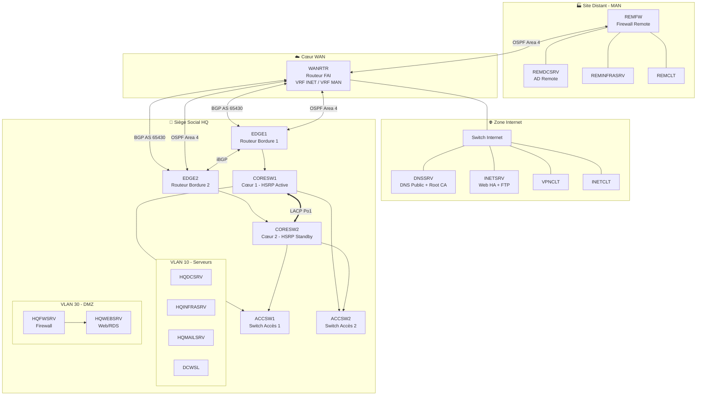

<p align="center">
  
</p>

<h1 align="center">
  🌐 Infrastructure Réseau WSL2025
  <br/>
  <sub>SAE 501 - Concevoir, Réaliser et Présenter une Solution Technologique</sub>
</h1>

<p align="center">
  
  
  
</p>

<p align="center">
  
  
  
</p>

<p align="center">
  <a href="#presentation">📌 Présentation</a> •
  <a href="#architecture">🏗️ Architecture</a> •
  <a href="#technologies">🛠️ Technologies</a> •
  <a href="#equipe">👥 Équipe</a> •
  <a href="#documentation">📂 Documentation</a>
</p>

---

<a id="presentation"></a>

## 🎯 Présentation

> _« Le professionnel R&T, en charge d'un projet technique, doit assurer l'ensemble des étapes du projet en concevant, réalisant et en présentant une solution technique mariant les différentes technologies réseaux, télécommunications et informatiques. »_
> — Programme National BUT R&T

Ce projet est réalisé dans le cadre de la **SAE 501** en 3ème année de **BUT Réseaux & Télécommunications** à l'IUT de Belfort-Montbéliard. Il s'appuie sur le sujet officiel de la compétition **WorldSkills Lyon 2025 - Skill 39 (IT Network Systems Administration)**.

### 📋 Contexte WorldSkills

|                        |                                                                 |
| ---------------------- | --------------------------------------------------------------- |
| 🏢 **Client fictif**   | WorldSkills Lyon 2025 (WSL2025) - Organisation des compétitions |
| 🤝 **Partenaire**      | WorldSkills France (WSFR) - Site distant connecté via MAN       |
| 👥 **Effectif simulé** | ~120 employés répartis sur 2 sites                              |
| 🎯 **Objectif**        | Infrastructure réseau complète, sécurisée et redondante         |

### 🏆 Compétences Développées

<table>
<tr>
<td align="center" width="25%">

**🔧 Infrastructure**
<br/>
<sub>Architecture multi-sites<br/>Redondance HSRP/LACP<br/>VRF & Segmentation</sub>

</td>
<td align="center" width="25%">

**🌐 Routage**
<br/>
<sub>OSPF Multi-Area<br/>BGP eBGP/iBGP<br/>NAT/PAT</sub>

</td>
<td align="center" width="25%">

**🖥️ Services**
<br/>
<sub>Active Directory<br/>DNS/DHCP/PKI<br/>Mail/Web/VPN</sub>

</td>
<td align="center" width="25%">

**🔐 Sécurité**
<br/>
<sub>Firewall nftables<br/>Certificats X.509<br/>VPN OpenVPN</sub>

</td>
</tr>
</table>

---

<a id="architecture"></a>

## 🏗️ Architecture

### Vue d'ensemble

```
┌─────────────────────────────────────────────────────────────────────────────┐
│                            🌐 INTERNET (Zone Publique)                       │
│    ┌─────────┐    ┌─────────┐    ┌─────────┐    ┌─────────┐                 │
│    │ DNSSRV  │    │ INETSRV │    │ VPNCLT  │    │ INETCLT │                 │
│    │ 8.8.4.1 │    │ 8.8.4.2 │    │ 8.8.4.3 │    │ 8.8.4.4 │                 │
│    └────┬────┘    └────┬────┘    └────┬────┘    └────┬────┘                 │
│         └──────────────┴──────────────┴──────────────┘                      │
└─────────────────────────────────┬───────────────────────────────────────────┘
                                  │
                    ┌─────────────┴─────────────┐
                    │         WANRTR            │
                    │    VRF INET / VRF MAN     │
                    │    (Routeur FAI Central)  │
                    └──────┬──────────┬─────────┘
           ┌───────────────┘          └───────────────┐
           │ BGP AS 65430                    OSPF Area 4
           ▼                                          ▼
┌──────────────────────────────────┐    ┌──────────────────────────────────┐
│        🏢 SITE HQ (Siège)        │    │      🏭 SITE REMOTE (WSFR)       │
│  ┌────────┐        ┌────────┐    │    │         ┌────────┐               │
│  │ EDGE1  │◄──────►│ EDGE2  │    │    │         │ REMFW  │               │
│  └───┬────┘ iBGP   └────┬───┘    │    │         └───┬────┘               │
│      │                  │        │    │             │                    │
│  ┌───┴────┐        ┌────┴───┐    │    │  ┌─────────┼─────────┐           │
│  │CORESW1 │◄══════►│CORESW2 │    │    │  │         │         │           │
│  └───┬────┘ LACP   └────┬───┘    │    │  ▼         ▼         ▼           │
│      │                  │        │    │ REMDCSRV REMINFRA  REMCLT        │
│  ┌───┴────┐        ┌────┴───┐    │    └──────────────────────────────────┘
│  │ACCSW1  │        │ACCSW2  │    │
│  └───┬────┘        └────┬───┘    │
│      │                  │        │
│  ┌───┴──────────────────┴───┐    │
│  │  VLAN 10: Servers        │    │
│  │  VLAN 20: Clients        │    │
│  │  VLAN 30: DMZ            │    │
│  │  VLAN 99: Management     │    │
│  └──────────────────────────┘    │
└──────────────────────────────────┘
```

### Schéma Mermaid Interactif



---

<a id="technologies"></a>

## 🛠️ Technologies

### Stack Réseau

<p align="center">
  
  
  
  
  
</p>

### Stack Systèmes

<p align="center">
  
  
  
  
</p>

### Stack Services

<p align="center">
  
  
  
  
  
</p>

---

## 📊 Plan d'Adressage IP (N=4)

### Réseaux Principaux

|      Zone       | VLAN | Nom        | Réseau           | Passerelle (VIP) |  Capacité |
| :-------------: | :--: | ---------- | ---------------- | ---------------- | --------: |
|    🏢 **HQ**    |  10  | Servers    | `10.4.10.0/24`   | `10.4.10.254`    | 254 hosts |
|    🏢 **HQ**    |  20  | Clients    | `10.4.20.0/23`   | `10.4.20.254`    | 510 hosts |
|    🏢 **HQ**    |  30  | DMZ        | `217.4.160.0/24` | `217.4.160.254`  | 254 hosts |
|    🏢 **HQ**    |  99  | Management | `10.4.99.0/24`   | `10.4.99.254`    | 254 hosts |
|  🏭 **Remote**  | 100  | Remote LAN | `10.4.100.0/25`  | `10.4.100.126`   | 126 hosts |
| 🌐 **Internet** |  -   | Public     | `8.8.4.0/29`     | `8.8.4.6`        |   6 hosts |

### Liaisons d'Interconnexion

| Liaison        | VLAN | Réseau           | Équipements | VRF  | Protocole |
| -------------- | :--: | ---------------- | ----------- | :--: | :-------: |
| EDGE1 ↔ WANRTR |  13  | `10.4.254.12/30` | .13 / .14   | MAN  |   OSPF    |
| EDGE1 ↔ WANRTR |  14  | `91.4.222.96/29` | .97 / .98   | INET |   eBGP    |
| EDGE2 ↔ WANRTR |  15  | `10.4.254.16/30` | .18 / .17   | MAN  |   OSPF    |
| EDGE2 ↔ WANRTR |  16  | `31.4.126.12/30` | .13 / .14   | INET |   eBGP    |
| WANRTR ↔ REMFW |  -   | `10.116.4.0/30`  | .2 / .1     | MAN  |   OSPF    |

---

## 🖥️ Inventaire des Machines

### 🏢 Site HQ (Siège - 6 serveurs)

| Serveur        | OS                   | IP            | Rôles                                |                 Doc                  |
| -------------- | -------------------- | ------------- | ------------------------------------ | :----------------------------------: |
| **HQDCSRV**    | Windows Server 2022  | `10.4.10.1`   | AD DS, DNS, ADCS (SubCA), GPO        |  [📘](documentation/04-HQDCSRV.md)   |
| **HQINFRASRV** | Debian 13            | `10.4.10.2`   | DHCP, VPN OpenVPN, NTP, Samba, iSCSI | [📘](documentation/01-HQINFRASRV.md) |
| **HQMAILSRV**  | Debian 13            | `10.4.10.3`   | Postfix, Dovecot, Roundcube, ZFS     | [📘](documentation/02-HQMAILSRV.md)  |
| **DCWSL**      | Debian 13 (Samba AD) | `10.4.10.4`   | Forest Root DC, DNS wsl2025.org      |   [📘](documentation/03-DCWSL.md)    |
| **HQFWSRV**    | Debian 13            | `217.4.160.1` | Firewall nftables, NAT/Routing       |  [📘](documentation/05-HQFWSRV.md)   |
| **HQWEBSRV**   | Windows Server 2022  | `217.4.160.2` | IIS, RDS (RemoteApp)                 |  [📘](documentation/06-HQWEBSRV.md)  |

### 🏭 Site Remote (3 équipements)

| Équipement      | OS                   | IP             | Rôles                      |                  Doc                  |
| --------------- | -------------------- | -------------- | -------------------------- | :-----------------------------------: |
| **REMFW**       | Cisco IOS (CSR1000v) | `10.4.100.126` | Routeur/Firewall ACL, OSPF |    [📘](documentation/09-REMFW.md)    |
| **REMDCSRV**    | Windows Server 2022  | `10.4.100.1`   | AD Child, DHCP, DNS, DFS   |  [📘](documentation/10-REMDCSRV.md)   |
| **REMINFRASRV** | Windows Server 2022  | `10.4.100.2`   | Failover DHCP/DNS, DFS     | [📘](documentation/11-REMINFRASRV.md) |

### 🌐 Zone Internet (4 machines)

| Machine     | OS            | IP        | Rôles                       |                Doc                |
| ----------- | ------------- | --------- | --------------------------- | :-------------------------------: |
| **DNSSRV**  | Debian 13     | `8.8.4.1` | DNS Public, Root CA, DNSSEC | [📘](documentation/13-DNSSRV.md)  |
| **INETSRV** | Debian 13     | `8.8.4.2` | Web HA (Docker), FTPS       | [📘](documentation/14-INETSRV.md) |
| **VPNCLT**  | Windows 11    | `8.8.4.3` | Client VPN (test)           | [📘](documentation/15-VPNCLT.md)  |
| **INETCLT** | Debian 13 GUI | `8.8.4.4` | Client Internet (test)      | [📘](documentation/16-INETCLT.md) |

---

## 🚀 Guide de Déploiement

### Ordre recommandé

```
Phase 1 - Fondations          Phase 2 - Services HQ        Phase 3 - Expansion
━━━━━━━━━━━━━━━━━━━           ━━━━━━━━━━━━━━━━━━━          ━━━━━━━━━━━━━━━━━━
   ┌─────────────┐               ┌─────────────┐              ┌─────────────┐
   │ 1. Switches │               │ 4. HQINFRASRV│              │ 7. REMFW    │
   │   & VLANs   │               │   DHCP/VPN  │              │   Routing   │
   └──────┬──────┘               └──────┬──────┘              └──────┬──────┘
          ▼                             ▼                            ▼
   ┌─────────────┐               ┌─────────────┐              ┌─────────────┐
   │ 2. Routeurs │               │ 5. HQFWSRV  │              │ 8. REMDCSRV │
   │ OSPF & BGP  │               │   Firewall  │              │   AD Child  │
   └──────┬──────┘               └──────┬──────┘              └──────┬──────┘
          ▼                             ▼                            ▼
   ┌─────────────┐               ┌─────────────┐              ┌─────────────┐
   │ 3. DNSSRV   │               │ 6. HQWEBSRV │              │ 9. Clients  │
   │  + DCWSL    │               │  + MAILSRV  │              │   & Tests   │
   └─────────────┘               └─────────────┘              └─────────────┘
```

### Commandes rapides

```bash
# Vérifier les adjacences OSPF
show ip ospf neighbor

# Vérifier les sessions BGP
show ip bgp summary

# Tester la connectivité inter-sites
ping 10.4.100.1 source 10.4.10.1
```

---

<a id="documentation"></a>

## 📂 Structure du Projet

```
📁 configreseau/
├── 📄 readme.md                 # Ce fichier
├── 📄 sujet1.md                 # Sujet technique complet (EN)
├── 📄 sujet2.md                 # Présentation SAE 501 (FR)
├── 🖼️ SAE501-2025-*.jpg         # Schémas d'architecture (4 fichiers)
│
├── 📁 documentation/            # 📘 Guides d'installation détaillés
│   ├── 00-INDEX.md              # Table des matières
│   └── [01-16]-*.md             # Procédures par machine
│
├── 📁 realconf/                 # ⚙️ Configurations réelles (Cisco IOS)
│   ├── PLAN-ADRESSAGE-IP.txt    # Plan d'adressage complet
│   ├── JALONS-PREUVES.txt       # Preuves de validation
│   ├── edge1.txt / edge2.txt    # Configs routeurs bordure
│   ├── coresw1.txt / coresw2.txt # Configs switches cœur
│   ├── accsw1.txt / accsw2.txt  # Configs switches accès
│   ├── wanrtr.txt               # Config routeur WAN (VRF)
│   └── remfw.txt                # Config firewall remote
│
└── 📁 virtconf/                 # 🧪 Configurations virtuelles (GNS3/EVE-NG)
    ├── jalon7-switches/         # Configs switches (jalon 7)
    └── jalon8-routeurs/         # Configs routeurs (jalon 8)
```

---

<a id="equipe"></a>

## 👥 Équipe - Groupe 4

<table>
<tr>
<td align="center" width="25%">
<br/>
<sub><b>Parcours Cyber</b></sub><br/>
<sub>PKI • Firewall • VPN</sub>
</td>
<td align="center" width="25%">
<br/>
<sub><b>Parcours Cyber</b></sub><br/>
<sub>AD • DNS • Sécurité</sub>
</td>
<td align="center" width="25%">
<br/>
<sub><b>Parcours PilPro</b></sub><br/>
<sub>Gestion de projet</sub>
</td>
<td align="center" width="25%">
<br/>
<sub><b>Parcours PilPro</b></sub><br/>
<sub>Gestion de projet</sub>
</td>
</tr>
</table>

> 📍 **Salle de réunion** : 005 | **Infra réseau** : Salle 203

---

## 🔐 Credentials par défaut

| Service            | Utilisateur     | Mot de passe |
| ------------------ | --------------- | ------------ |
| Équipements réseau | `admin`         | `P@ssw0rd`   |
| Domaine AD         | `Administrator` | `P@ssw0rd`   |
| Linux (root)       | `root`          | `P@ssw0rd`   |

> ⚠️ **Note** : Le zéro (0) est entre le "w" et le "r"

### Domaines Active Directory

```
wsl2025.org          (Forest Root - DCWSL)
├── hq.wsl2025.org   (Child Domain - HQDCSRV)
└── rem.wsl2025.org  (Child Domain - REMDCSRV)
```

---

## 📈 Progression

```
Cœur Réseau      [██████████████████████████████] 100% ✅
Services HQ      [██████████████████████████████] 100% ✅
Site Remote      [██████████████████████████████] 100% ✅
Documentation    [██████████████████████████████] 100% ✅
Tests & Valid.   [██████████████████████████████] 100% ✅
```

---

## 📚 Ressources

- 🔗 [WorldSkills France](https://www.worldskills-france.org)
- 🔗 [Moodle SAE 501](https://moodle.univ-fcomte.fr)
- 🔗 [IUT Belfort-Montbéliard](https://www.iut-bm.univ-fcomte.fr/)

---

<p align="center">
  
  
</p>

<p align="center">
  <sub>
    <b>SAE 501</b> • BUT Réseaux & Télécommunications • 3ème année<br/>
    Université de Franche-Comté • Décembre 2025<br/><br/>
    <i>Basé sur le sujet WorldSkills Lyon 2025 - Skill 39 (IT Network Systems Administration)</i>
  </sub>
</p>

<p align="center">
  <sub>
    © WorldSkills France - Reproduction autorisée à des fins pédagogiques non commerciales
  </sub>
</p>
